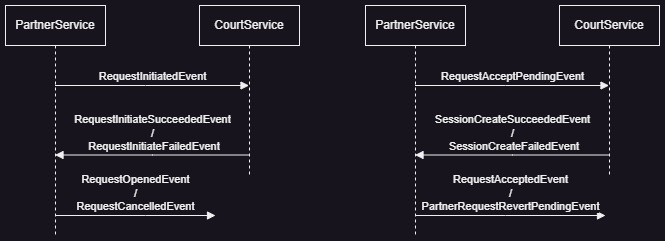

# Partnerservice

This project uses Quarkus, the Supersonic Subatomic Java Framework.

If you want to learn more about Quarkus, please visit its website: https://quarkus.io/ .

## Technologies
- Quarkus 3.0
- Redis streams
- Debezium
- Postgresql
- MongoDB
- Java 11
- Docker
- Kubernetes
- Swagger UI
- Linode Server Deployment (only during development)

## Domain Driven Design
We created the PartnerRequest Entity according to the domain model that was defined during the modelling process.
The model can be found in the following class:\
_at.fhv.matchpoint.partnerservice.domain.model.PartnerRequest_

## Event Driven Architecture
### Event Sourcing
The implementation of Event Sourcing can be found in the following packages and classes:\
_at.fhv.matchpoint.partnerservice.events.*_\
_at.fhv.matchpoint.partnerservice.infrastructure.repository.EventRepository_

at.fhv.matchpoint.partnerservice.domain.model.PartnerRequest\
- Apply and Process methods (67 - 172)

All system and business relevant operations will create an event that gets persisted in our MongoDB.\
This means that state change and persistence of the domain model is driven by events themselves, and events
are not created simply as a byproduct.\
Through the use of Transactional Log Tailing with Debezium, these events will then be published to Redis streams.

### CQRS
CQRS is implemented in the following classes:
_at.fhv.matchpoint.partnerservice.infrastructure.repository.MemberRepository_\
_at.fhv.matchpoint.partnerservice.infrastructure.repository.PartnerRequestReadModel_\
_at.fhv.matchpoint.partnerservice.infrastructure.consumer.MemberEventConsumer_\
_at.fhv.matchpoint.partnerservice.infrastructure.consumer.PartnerRequestEventConsumer_

We have two Read models in our Microservice. One for the members created in the Memberservice, and one for the READ
operations of our own PartnerService.

**Workflow**:\
Both the MemberEventConsumer and PartnerRequestEventConsumer listen to their respective events.\
Depending on the event, they then look for existing entities in the ReadModel databases to apply the events to,
and persist the new state. This is needed for the following operations:\
For each CUD operation of this microservice, the memberId is used. To eliminate the need to make a synchronous call
to the member service in order to verify the member itself, we create our own read models of the members,
so we can verify them directly with our read model.\
For each READ operation, we use the read models of the PartnerRequests in order to avoid
rebuilding the current state from all previous events each time a READ request gets made.
### Optimistic Locking
The implementation of the Optimistic Locking approach can be found in the following class:\
_at.fhv.matchpoint.partnerservice.application.impl.PartnerRequestServiceImpl_
Lines:
- 79
- 105
- 131
- 179 - 183

For each CUD Operation, before the new events get persisted and applied, a version check if performed.
This version check includes a comparison of the number of events previously selected, and current number of events
in the database. Similarly to a reread, this makes sure that during the processing time there weren't any new events
added for a specific aggregateId.

### Message Ordering
The Message Ordering implementation can be found in the following classes:\
_at.fhv.matchpoint.partnerservice.infrastructure.PartnerRequestEventHandler_\
Lines:
- 29
- 51
- 63
- 70
- 77
- 84
- 91

_at.fhv.matchpoint.partnerservice.infrastructure.consumer.MemberEventConsumer_\
Lines:
- 133
- 157
- 173

In order to guarantee the Message Ordering, or the correct order in which the events get accepted and processed
we used the properties of the event enrichment approach. This allowed us to ignore events that would be applied in the
wrong order, because all events carry all necessary information, which in turn means that it doesn't matter if one event
gets skipped.

### Message Tracking
Message Tracking was implemented in the following classes:\
_at.fhv.matchpoint.partnerservice.infrastructure.consumer.MemberEventConsumer_\
Lines:
- 136

_at.fhv.matchpoint.partnerservice.infrastructure.PartnerRequestEventHandler_\
Lines:
- 33

This approach makes sure that events that have already been processed are not processed again.
Since the messages get written into our Tracking-Database, when an Event gets persisted a second time
with the same id the transaction will fail. When this happens we simply acknowledge the message again,
so it doesn't get processed again.

## Interprocess Communication
Asynchronous Message Consumers are implemented in the following package:\
_at.fhv.matchpoint.partnerservice.infrastructure.consumer.*_

All of these consumers subscribe to a Redis Stream to read events and process them accordingly.

## Caching
Caching is implemented in the following class:\
_at.fhv.matchpoint.partnerservice.application.impl.PartnerRequestServiceImpl_\
Lines:
- 45
- 63
- 89
- 115
- 154

The @CacheResult annotation allows the return value of the method to be cached. When the same method now gets called again,
the cached return value will be used.
When one of the methods with the annotation @CacheInvalidate gets called, as the name suggests the cache gets invalidated,
which means that the cached responses can no longer be used, and the method has to be executed normally first again.

## Sagas
### Choreography-based

### Semantic Locking
Semantic Locking is implemented in the following classes:\
_at.fhv.matchpoint.partnerservice.events.request.RequestInitiatedEvent_\
_at.fhv.matchpoint.partnerservice.events.request.AcceptPendingEvent_\

_at.fhv.matchpoint.partnerservice.domain.model.PartnerRequest_\
Lines:
- 127
- 137
- 147

Since we implemented our create and accept process with events as part of our SAGA, we created 2 "PENDING"
states to signal that these entities are currently part of an ongoing SAGA.
When a PartnerRequest is created, it is first set to an "INITIATED" state. Once the creation is confirmed or denied
by the CourtService through a Succeeded or Failed event, we set the state to "OPEN" or "CANCELLED", effectively freeing
the entities for further use (at least in the case of "OPEN").\
Similarly when a PartnerRequest wants to be accepted, the state first gets set to "ACCEPT_PENDING". Again, once the
operation is confirmed of denied by the CourtService the state then gets set to "ACCEPTED" or "CANCELLED".

## Role Based Authorization
Role Based Authorization through the annotation @RolesAllowed in the following class:\
_at.fhv.matchpoint.partnerservice.rest.PartnerRequestResource_

## API Gateway
The API Gateway makes sure that the end points of our PartnerService can not directly be accessed.
They have to be accessed through the API Gateway, which also means they have to be authenticated and provide a JWT,
which in turn will be used by the PartnerService to perform a role based authorization as described above. 
### Authentication
Authentication is implemented in the following class in the API Gateway Project:\
_at.fhv.matchpoint.apigateway.authentication.AuthResource_

Here two endpoints are provided, one to register and one to login. The login endpoint will then create a token.
Without this token it is not possible to make a request to the API Gateway. This is enforced through the @Authenticated
in the controller of the PartnerService.\
_at.fhv.matchpoint.apigateway.partnerServiceRouting.PartnerServiceController_

### Fault tolerance
#### Circuit Breaker and Fallbacks
Circuit Breaker and Fallbacks are implemented in the following classes in the API Gateway Project:\
_at.fhv.matchpoint.apigateway.partnerServiceRouting.PartnerServiceController_

The Circuit Breaker will switch to open when 50% or the last 10 requests fail.
If the Circuit Breaker is currently open and the next consecutive two requests are successful, it will switch to
closed, otherwise the state will stay open.
Furthermore, when the Circuit Breaker is open and/or a request to the API Gateway which would be redirected to the
PartnerService fails, there will be a fallback response. This will let the Requesting party know that the PartnerService
is currently unavailable.

## CI/CD Pipeline
The CI/CD Pipelines are implemented in the .github/workflow folder.
The gradle.yml will build and test the application.
The main.yml will build the application, produce an artifact, builds the docker image and pushes the docker image to
docker hub

## Running the application in dev mode

You can run your application in dev mode that enables live coding using:
```shell script
./gradlew quarkusDev
```

> **_NOTE:_**  Quarkus now ships with a Dev UI, which is available in dev mode only at http://localhost:8080/q/dev/.

## Packaging and running the application

The application can be packaged using:
```shell script
./gradlew build
```
It produces the `quarkus-run.jar` file in the `build/quarkus-app/` directory.
Be aware that it’s not an _über-jar_ as the dependencies are copied into the `build/quarkus-app/lib/` directory.

The application is now runnable using `java -jar build/quarkus-app/quarkus-run.jar`.

If you want to build an _über-jar_, execute the following command:
```shell script
./gradlew build -Dquarkus.package.type=uber-jar
```

The application, packaged as an _über-jar_, is now runnable using `java -jar build/*-runner.jar`.

## Creating a native executable

You can create a native executable using: 
```shell script
./gradlew build -Dquarkus.package.type=native
```

Or, if you don't have GraalVM installed, you can run the native executable build in a container using: 
```shell script
./gradlew build -Dquarkus.package.type=native -Dquarkus.native.container-build=true
```

You can then execute your native executable with: `./build/partnerservice-1.0.0-SNAPSHOT-runner`

If you want to learn more about building native executables, please consult https://quarkus.io/guides/gradle-tooling.

## Related Guides

- MongoDB client ([guide](https://quarkus.io/guides/mongodb)): Connect to MongoDB in either imperative or reactive style
- REST Client Reactive ([guide](https://quarkus.io/guides/rest-client-reactive)): Call REST services reactively
- MongoDB with Panache ([guide](https://quarkus.io/guides/mongodb-panache)): Simplify your persistence code for MongoDB via the active record or the repository pattern
- SmallRye OpenAPI ([guide](https://quarkus.io/guides/openapi-swaggerui)): Document your REST APIs with OpenAPI - comes with Swagger UI
- RESTEasy Reactive ([guide](https://quarkus.io/guides/resteasy-reactive)): A JAX-RS implementation utilizing build time processing and Vert.x. This extension is not compatible with the quarkus-resteasy extension, or any of the extensions that depend on it.
- Redis Client ([guide](https://quarkus.io/guides/redis)): Connect to Redis in either imperative or reactive style

## Provided Code

### RESTEasy Reactive

Easily start your Reactive RESTful Web Services

[Related guide section...](https://quarkus.io/guides/getting-started-reactive#reactive-jax-rs-resources)

### Debezium

Start MongoDB

```shell script
    docker compose up -d mongodb
```
Init MongoDB for replica

```shell script
    docker compose exec mongodb bash -c '/usr/local/bin/init.sh'
```
Start Debezium

```shell script
    docker compose up -d debezium'
```


